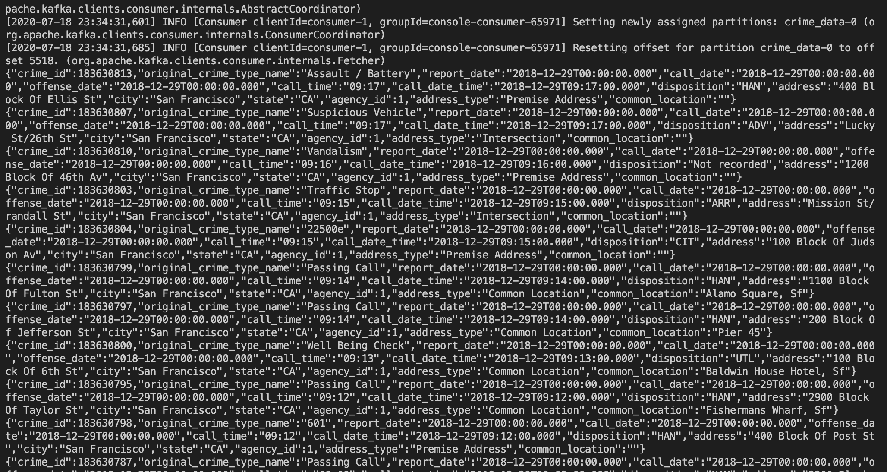

# San Francisco Crime

## Running Project

### Start Kafka & Zookeeper Services

```
docker-compose up -d kafka0 zookeeper
```

### Start Producer to upload AVRO records to Kafka

```
docker-compose run --rm producer python kafka_server.py -t crime_data -b kafka0:9093 ./producer_server/police-department-calls-for-service-schema.json police-department-calls-for-service.json
```

### Start Consumer to download AVRO records

```
docker exec -ti  $(docker-compose ps -q spark ) bash  spark-submit --packages org.apache.spark:spark-sql-kafka-0-10_2.11:2.4.3 --conf spark.executor.memory=1g --conf spark.executor.cores=1 --conf spark.driver.memory=1g --conf spark.driver.cores=1 ./data_stream.py
```

## Picture Submissiones

### Picture 1 - Take a screenshot of your kafka-consumer-console output. You will need to include this screenshot as part of your project submission.



### Q1 - Picture 1 - Take a screenshot of your progress reporter after executing a Spark job.


### Q1 - Picture 2 - Take a screenshot of the Spark Streaming UI as the streaming continues.


### Picture 2 - Take a screenshot of your progress reporter after executing a Spark job.


### Picture 3 - Take a screenshot of the Spark Streaming UI as the streaming continues.


## Respones

### How did changing values on the SparkSession property parameters affect the throughput and latency of the data?

max offset per trigger - the throughput was greatly increased just by increasing the this number because it would allow the client to greatly increase the fetch amount of rows from kafka.

### What were the 2-3 most efficient SparkSession property key/value pairs? Through testing multiple variations on values, how can you tell these were the most optimal?

The most efficient pairs were high in memory, medium on cores, and really high on max offset per trigger. In the table below you can see the mean and mediam of records processed per second based on the different variables I changed. The value the most impacted the performance was **max offset per trigger**.

| spark.executor.memory | spark.executor.cores | max offset per trigger | mean   | median |
|-----------------------|----------------------|------------------------|--------|--------|
| 2g                    | 1                    | 10                     | 2.1279 | 2.3315 |
| 1g                    | 1                    | 200                    | 32.45  | 36.28  |
| 1g                    | 1                    | 500                    | 75.49  | 78.38  |


Below is the table containing all of the tests I performed.

| spark.executor.memory | spark.executor.cores | max offset per trigger | mean   | median |
|-----------------------|----------------------|------------------------|--------|--------|
| 1g                    | 1                    | 10                     | 1.903  | 2.018  |
| 1g                    | 2                    | 10                     | 1.9881 | 2.11   |
| 1g                    | 3                    | 10                     | 1.8813 | 2.0359 |
| 1g                    | 4                    | 10                     | 2.06   | 2.316  |
| 2g                    | 1                    | 10                     | 2.1279 | 2.3315 |
| 2g                    | 2                    | 10                     | 1.6425 | 1.7528 |
| 2g                    | 3                    | 10                     | 1.8041 | 1.8723 |
| 2g                    | 4                    | 10                     | 1.8484 | 2.0739 |
| 1g                    | 1                    | 200                    | 32.45  | 36.28  |
| 1g                    | 2                    | 200                    | 27.55  | 31.08  |
| 1g                    | 3                    | 200                    | 27.53  | 32.24  |
| 2g                    | 1                    | 200                    | 31.66  | 34.41  |
| 1g                    | 1                    | 500                    | 75.49  | 78.38  |

